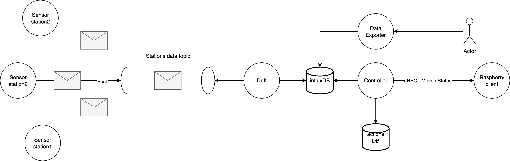

# Useful links

### Dashboard:

http://localhost

### Actions - DB:

http://localhost:8080

* **System**: PostgreSQL
* **Username**: admin
* **Password**: Asdf1234
* **database**: actions

### InfluxDB 

http://localhost:8086
* **Username**: admin
* **Password**: Asdf1234

## First time?

To provision the whole enviroment in the server, just run:

``` bash
make run
```

Then, turn on all the arduino stations.

## New changes / Update?

To update the local server just run

``` bash
make run
```

or 

``` bash
docker compose down
make run
```

## Architecture



Stations report their data as JSON to the topic *station/report*, the topic is being served by a MQTT broker running on the server **192.168.0.40** ( The ip is static on the router by DHCP configuration on the router ); a golang app Drift will read all messaages on the topic *station/report* and will apply all drift updates needed, to later publish the data with the drift to the *station/drift* topic. 

**Telegraf** agent will ingest the data from  *station/drift* topic into InfluxDB. 

Data exporter use the data ingested in the influxDB.

Controller will fetch the data from influxDB, and perform the actions needed, saving each intervention into the postgreSQL database.

A python client installed into the turtle Bot raspberry expose a gRCP server for reciving instructions about where to go. The client is running on a tmux terminal in order to avoid stopic the server as the terminal is deatached.

## Folders structure

* **ardiono_station** : This one contains the code for the arduino stations, configured to already send the data to the MQTT broker. Open the project with **PlatformIO**

* **data-orchestation** : This folder contains all the golang applications that handle the drift, dashbaord, exporter and controller. The last one is a state machine that act autonomously.

* **mosquitto** and **telegraf** : Folders for storing their respective configuration for running on Docker compose. **Mosquitto** is the MQTT broker, **telegraft** is the responsable of ingesting data from a topic into influxDB.

* **protos**: gRPC protos for controller to Turtlebot communication.

* **simulation**: golang script that sends fake station data to the topics, it is useful when debugging without needing to turn on stations.

* **turtlebot-agent**: Python agent, responsable of implementing the gRPC server, this one is deployed on the rasbperry pi of the turtle bot.


